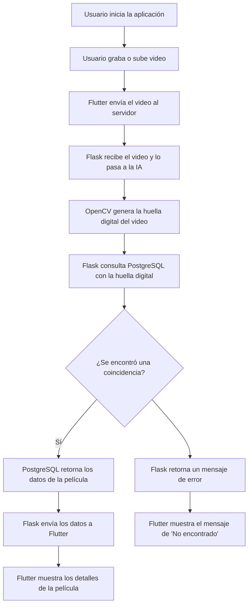

## Esquema sobre la organizaion de las carpetas
Esquema generalizado sobre el flujo que tendran las carpetas, y como se trabajaran con ellas

```
/tu-proyecto-shazam-movies         # Carpeta principal del proyecto
├── /backend                        # Contiene todo el código del servidor
│   ├── /api                        # Lógica de la API (Flask)
│   │   ├── app.py                  # Archivo principal de la aplicación Flask
│   │   ├── routes.py               # Rutas de la API (endpoints)
│   │   └── __init__.py             # Inicialización del módulo
│   ├── /ml                         # Módulo de la Inteligencia Artificial
│   │   ├── video_processor.py      # Lógica para procesar el video con OpenCV/TensorFlow
│   │   └── model                   # (Opcional) Carpeta para modelos de IA pre-entrenados
│   ├── /database                   # Archivos relacionados con la base de datos
│   │   ├── schema.sql              # Esquema de las tablas de PostgreSQL
│   │   └── db_connection.py        # Módulo para la conexión a la base de datos
│   └── requirements.txt            # Dependencias de Python
│
├── /frontend                       # Contiene el código de la aplicación móvil (Flutter)
│   ├── /lib                        # Archivos de código Dart
│   │   ├── main.dart               # Punto de entrada de la aplicación
│   │   ├── /screens                # Pantallas y vistas de la interfaz
│   │   ├── /widgets                # Componentes reutilizables de UI
│   │   ├── /services               # Lógica de comunicación con el backend (API)
│   │   └── /models                 # Modelos de datos de la app
│   ├── /assets                     # Archivos estáticos como imágenes, videos, etc.
│   └── pubspec.yaml                # Dependencias de Flutter
│
└── README.md                       # Documentación general del proyecto
```


## Flujo de trabajo que tendra la aplicacion 




